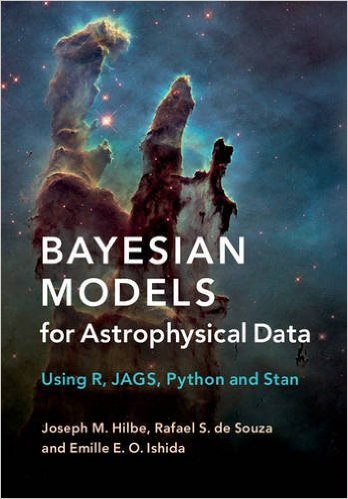

```{r setup, include=FALSE}
knitr::opts_chunk$set(echo = FALSE)
```


## A statistical computing environment 


* R is an open source programming language and software environment for statistical computing and graphics

* Available from http://www.r-project.org for Windows, Mac or linux. 

* $>$ 10500 user-provided add-on CRAN packages, tens of thousands of statistical functions. On-the-fly installation of CRAN packages

* Learning curve:  trade-off between finding   what you want, and understanding what you find. 

## Some topics covered by R packages

  | |
------------- | -------------------------- | -------------
Bayesian Inference         | Machine Learning  |  Social Sciences  
Computational Physics      | Medical Image Analysis | Spatial Data
Cluster Analysis           | Multivariate Statistics | Statistical Geneticss
Differential Equations     | Natural Language | Survival Analysi 
Econometrics               | Numerical Mathematic | Time Series Analysis 
Environmetrics             | Optimization | Visualization | High-Performance Computing
Environmetrics             | Pharmacokinetic | Web Technologies 
Extreme Value Analysis     | Phylogenetics | **Astronomy**
Empirical Finance          | Probability Distributions
Functional Data Analysis   | Psychometric 

  
## Required packages for today's lesson 

```{r,echo=T,message=F, warning=FALSE}
require(ggplot2);require(reshape2);require(circlize);require(ggdendro);
require(PerformanceAnalytics);require(ggthemes);require(RColorBrewer);
require(psych)
```

> If not available

```{r,echo=T,message=F, warning=FALSE,eval=F}
install.packages(c("ggplot2","reshape2","circlize","ggdendro","ggthemes",
"RColorBrewer","reshape2","PerformanceAnalytics","psych"),dependencies = T)
```


```{r,echo=F,message=F, warning=FALSE}
require(DT);require(webshot);require(plotly);require(d3heatmap);
require(chorddiag);require(rCharts);require(slidifyLibraries);require(pander)
```

## Basic commands 

```{r,echo=T,message=F, warning=FALSE}
1+1
x <- 2
for (i in 1:5){
print(x+i)  
}
print("Life, the Universe and Everything")
```

## Basic commands 

```{r,echo=T,message=F, warning=FALSE}
x <- rnorm(5000) # Generate 5000 random numbers from a Normal distribution
hist(x,col="green") # Plot a histogram
```

## Simple regression model 

```{r,echo=T,message=F, warning=FALSE}
set.seed(1056)              # set seed to replicate example
nobs= 150                   # number of obs in model 
x1 <- runif(nobs,0,5)       # random uniform variable
mu <- 1 + 5 * x1            # linear predictor, xb
y <- rnorm(nobs, mu, sd=1)  # create y as adjusted random normal variate 
fit <- lm(y ~ x1)           # Normal Fit 
```

```{r,echo=T,message=F, warning=FALSE,eval=F}
summary(fit) # Display results from the fit
```

```{r,echo=F,message=F, warning=FALSE}
pander(fit)
```

## Display results-base R

```{r,echo=T,message=F, warning=FALSE}
xx <- seq(0,5,length=200)
ypred <- predict(fit,newdata=list(x1=xx),type="response")     # Prediction from the model 

plot(x1,y,pch=19,col="red")                                   # Plot regression line 
lines(xx,ypred,col='cyan',lwd=4,lty=2)

segments(x1,fitted(fit),x1,y,lwd=2,col="gray")                # Add the residuals
```


 
## Display results-ggplot

```{r,echo=T,message=F, warning=FALSE}
dat <- data.frame(x1,y)
ggplot(data=dat,aes(x =x1, y = y)) + 
  geom_point() +
  stat_smooth(method = "lm", col = "red")
```


## Data-mining-Exoplanets catalogue 

Data from http://www.openexoplanetcatalogue.com

Read and display data in  tabular format
```{r,echo=T, eval=FALSE}
d <- read.csv("exoplanets.csv",header = T)
d <- d[complete.cases(d),]
head(d)
```

```{r}
d <- read.csv("exoplanets.csv",header = T)
d <- d[complete.cases(d),]
datatable(d)
```


## Visualization-Scatter plot

```{r,echo=T, message=F, warning=FALSE}
p1 <- ggplot(data = d, aes(x = Period, y = star_mass, group=Discovery_method,
  fill = Discovery_method,text=name,size=Radius)) + geom_point(alpha=0.5) +
  scale_x_log10() + ylab("Stellar Mass") + xlab("Period")+
  theme(legend.position = "none")
```

```{r,echo=T,eval=F}
p1
```

```{r}
ggplotly(p1)
```

## Visualization-Scatter plot

```{r, echo=T,message=F, warning=FALSE}
p2 <- ggplot(data = d, aes(x = star_mass, y = star_radius, group=Discovery_method, text=name,size=Radius,colour=Discovery_method)) +theme_bw()+
geom_point(alpha=0.6) +scale_x_log10() + xlab("Stellar Mass") + ylab("Stellar Radius")+
theme(legend.position = "right")+scale_size(range=c(2,10))+ scale_color_tableau(name="")
```

```{r,echo=T,eval=F}
p2
```

```{r}
ggplotly(p2)
```

## Visualization-Linear Fit  

```{r, echo=T, message=F, warning=FALSE}
p3 <- ggplot(data = d, aes(x = star_mass,y =star_radius,size=Radius)) +
  geom_point(size=2.5,alpha=0.6,colour="red") + geom_smooth(size=2,method = "loess")+
  xlab("Stellar Mass") + ylab("Stellar Radius")+scale_size(range=c(2,10))
```

```{r,echo=T,eval=F}
p3
```

```{r}
ggplotly(p3)
```


## Visualization-Boxplot

```{r, echo=T, message=F, warning=FALSE}
xcut <- cut(log10(d$Period),breaks=5)
d$xcut <- xcut

p4 <- ggplot(data = d, aes(x = log10(Period), y = star_mass)) +
   geom_boxplot(data = d, aes(x = xcut,y = star_mass),fill="red3")+  
   geom_point(aes(group=Discovery_method,  fill = Discovery_method,
   text=name,size=Radius), alpha=0.3) +
   xlab("Stellar Mass") + ylab("Stellar Radius") +
  theme(legend.position = "none")
```

```{r,echo=T,eval=F}
p4
```

```{r}
ggplotly(p4)
```


## Visualization-Boxplot

```{r, echo =T, message=F, warning=FALSE}
xcut <- cut(log10(d$Period),breaks=5)
d$xcut <- xcut
p5 <- ggplot(data = d, aes(x = log10(Period), y = star_mass)) +
   geom_boxplot(data = d, aes(x = xcut,y = star_mass),fill="red3")+  
   xlab("Stellar Mass") + ylab("Stellar Radius") +
  theme(legend.position = "none")
```

```{r,echo=T,eval=F}
p5
```

```{r}
ggplotly(p5)
```


## Visualization-Violin plot

```{r, echo=T, message=F, warning=FALSE}
xcut <- cut(log10(d$Period),breaks=5)
d$xcut <- xcut
p6 <- ggplot(data = d, aes(x = log10(Period), y = star_mass)) +
   geom_violin(data = d, aes(x = xcut,y = star_mass),fill="red3")+  
   xlab("Stellar Mass") + ylab("Stellar Radius")+
  theme(legend.position = "none")
```

```{r,echo=T,eval=F}
p6
```

```{r}
ggplotly(p6)
```


## Visualization-Histograms 

```{r, echo=T, message=F, warning=FALSE}
p7 <- ggplot(data = d, aes(x = Radius)) + geom_histogram(bins = 45,fill="red")
```

```{r,echo=T,eval=F}
p7
```

```{r}
ggplotly(p7)
```


## Visualization-Kernel Density

```{r,echo=T, message=F, warning=FALSE}
p8 <- ggplot(data = d, aes(x = Radius)) + geom_density(fill="red")
```

```{r,echo=T,eval=F}
p8
```

```{r}
ggplotly(p8)
```


## Visualization-Kernel Density 
By groups

```{r, echo=T,message=F, warning=FALSE}
p9 <- ggplot(data = d, aes(x = Radius,group=Discovery_method,fill=Discovery_method)) +
      geom_density()+ scale_fill_discrete(name="")
```

```{r,echo=T,eval=F}
p9
```

```{r}
ggplotly(p9)
```

## Visualization-Kernel Density 
By groups

```{r, echo=T,message=F, warning=FALSE}
p10 <- ggplot(data = d, aes(x = Radius,group=Discovery_method,fill=Discovery_method)) +
      geom_density(adjust=1.5, position="fill")+ scale_fill_discrete(name="")
```

```{r,echo=T,eval=F}
p10
```

```{r}
ggplotly(p10)
```


## The Big Picture

### Correlation matrix
```{r,echo=T, message=F, warning=FALSE,eval=F}
dcor <- cor(d[,c(2,3,5,6,7)])
print(dcor)
```

```{r,echo=F, message=F, warning=FALSE}
dcor <- cor(d[,c(2,3,5,6,7)])
pander(dcor)
```


## Visualization-correlation matrix
```{r,echo=T, message=F, warning=FALSE}
c0 <- scale(log10(d[,c(2,3,5,6,7)]))
chart.Correlation(c0, histogram=TRUE, pch=19)
```

## Visualization-correlation matrix
```{r,echo=T, message=F, warning=FALSE}
pairs.panels(log10(d[,c(2,3,5,6,7)]), scale=TRUE)
```

## Visualization-Heatmap 
```{r, message=F, warning=FALSE}
c <- melt(dcor)
q <- ggplot(data=c,aes(x=Var1, y=Var2)) + geom_tile(aes(fill = value)) +
   scale_fill_gradient2(limits=c(-1, 1)) + xlab("") + ylab("")
ggplotly(q)
```

---  
## Visualization-Heatmap with Dendrograms
```{r, message=F, warning=FALSE}
d3heatmap(cor(d[,c(2,3,5,6,7)]), scale="column", colors = "Blues")
```


## Visualization-Dendrograms 
```{r, message=F, warning=FALSE}
m <- cor(d[,c(2,3,5,6,7)])
hc = hclust(dist(m))
d1 <- ggdendrogram(hc, rotate = TRUE, theme_dendro = FALSE)
d1
```


## Visualization-Chord Diagram

See de Souza, Dantas, et al 2017 [arXiv:1703.07607](https://arxiv.org/abs/1703.07607) 

```{r,echo=T, eval=FALSE}
nc <- cor(d[,c(2,3,5,6,7)])
chordDiagram(nc)
```


```{r, message=F, warning=FALSE}
nc <- as.matrix(cor(d[,c(2,3,5,6,7)]))
# Make the circular plot
chorddiag(nc)
```

## What about Beers?


```{r,echo=T,message=F, warning=FALSE}
beer <- read.csv("beer2.csv",header = T)
beer <- beer[complete.cases(beer),]
```

```{r,echo=T,eval=F}
head(beer)
```

```{r}
DT::datatable(beer)
```


## Beers-scatter plot

```{r}
colourCount = length(unique(beer$style))
getPalette = colorRampPalette(brewer.pal(9, "Set1"))
 
b1 <- ggplot(data = beer, aes(x = abv, y = ibu, group=style,size=ibu,
 color=style,alpha=0.7)) +
  geom_point()  + ylab("IBU") + xlab("Alcohol")+
 scale_color_tableau(name="")+theme_hc()+
  scale_alpha(name="",guide="none")+
  scale_size(guide="none",range=c(2,8))

ggplotly(b1)
```

## Beers-boxplot 

Data from https://www.kaggle.com
```{r}

b1 <- ggplot(data = beer, aes(x = style, y=ibu,fill=style)) +
  geom_boxplot()  + ylab("IBU") + xlab("")+coord_flip()+
  scale_fill_stata(name="")+theme_hc()
ggplotly(b1)
```

## Beers-Density 
```{r}

b1 <- ggplot(data = beer, aes(x = ibu,fill=style,group=style)) +
  geom_density()  + xlab("IBU") +
  scale_fill_stata(name="")+theme_hc()
ggplotly(b1)
```

## Beers-Hexagon Binning 
```{r}
h0 <-ggplot(data = beer, aes (x = ibu, y = abv, fill = style,alpha=ibu)) + stat_binhex (bins=5,aes (alpha = ..count..)) + facet_wrap (~style)+scale_alpha(name="",range=c(0.4,1))+theme_hc()+
  theme(legend.position = "none")+scale_fill_stata()+ xlab("IBU") + ylab("Alcohol")
h0
```

## Another case-Titanic

```{r,echo=T,message=F, warning=FALSE}
titan <- as.data.frame(Titanic)
head(titan)
```

###  Bar-plot 
```{r,echo=T,message=F, warning=FALSE}
t1 <- ggplot(titan,aes(x=Class,y=Freq,fill=Survived))+geom_bar(stat="identity")+facet_wrap(Sex~Age)+
  theme_dark()+scale_fill_pander()+ylab("Passengers")
```

```{r,echo=T,eval=F}
t1
```

```{r}
ggplotly(t1)
```


## Zombies
### Not related, but still important


### The system is given as:
$\frac{dS}{dt} = P - BSZ - dS$

$\frac{dZ}{dt} = BSZ + GR - ASZ$

$\frac{dR}{dt} = dS + ASZ - GR$


### Notations
| 
------------------------------------- | -------------------------------------
S: the number of susceptible victims  |d: the chance of a natural death
Z: the number of zombies              |B: the chance the "zombie disease" is transmitted
R: the number of people **killed**    |G: the chance a dead person is resurrected into a zombie
P: the population birth rate          |A: the chance a zombie is totally destroyed


## Modeling Zombie apocalypse  in R

See [Munz et al. 2009](http://mysite.science.uottawa.ca/rsmith43/Zombies.pdf) and [Modeling a Zombie Apocalypse in Python](http://scipy-cookbook.readthedocs.io/items/Zombie_Apocalypse_ODEINT.html)

```{r,echo=T,message=F, warning=FALSE}
library(deSolve)

```

### Initial Conditions
```{r,message=F, warning=FALSE,echo=T}
parameters <- c(P = 15,      # birth rate
                d = 0.0000005,  # natural death percent (per day)
                B = 0.00010,  # transmission percent  (per day)
                G = 0.0005,  # ressurect percent (per day)
                A = 0.000025)  # destroy percent  (per day))


state <- c(S=50000, # initial population
           Z=0,  # initial zombie population
           R=0   # initial death population
           )  
```


### Solve the ODE

```{r,message=F, warning=FALSE,echo=T}
zoombie <- function(t, state, parameters){
with(as.list(c(state, parameters)),{
  #the model equations (see Munz et al. 2009)
  dS <- P - B*S*Z - d*S
  dZ <- B*S*Z + G*R - A*S*Z
  dR <- d*S + A*S*Z - G*R
  output <- list(c(dS,dZ,dR))
  return(output)  
})
}
```

```{r,message=F, warning=FALSE,echo=T}
times <- seq(0, 20, by = 0.025)
out <- ode(y = state, times = times, func = zoombie, parms = parameters)
head(out)
```


## Plot results with ggplot2

```{r,message=F, warning=FALSE,echo=T}
dat <- as.data.frame(out)
dat2 <- melt(dat,id="time")
z1 <-ggplot(data=dat2,aes(x=time,y=value,group=variable,colour=variable,linetype=variable))+
  geom_line(size=2)+theme_hc()+ylab("Population")+xlab("Days after break")+
  scale_color_stata(name="",labels = c("Population", "Zombies","Victims"))+
  scale_linetype_stata(name="",labels = c("Population", "Zombies","Victims"))
```

```{r,echo=T,eval=F}
z1
```

```{r}
ggplotly(z1)
```

## Exercise

Choose a dataset and write a brief 1-2 page report with

* Data description (which are each column)
* One-two data visualizations with a brief explanation of what we can conclude in each 

Potential data sources

* Type data() in the R terminal to get several options
* https://www.kaggle.com
* https://www.galaxyzoo.org
* Your own work 

## Wanna know more about Statistics?


Available at [Amazon](https://www.amazon.com/Bayesian-Models-Astrophysical-Data-Python/dp/1107133084%3FSubscriptionId%3DAKIAJWSJBGAYE3WNEIRQ%26tag%3Dlove-bookstore-com-20%26linkCode%3Dxm2%26camp%3D2025%26creative%3D165953%26creativeASIN%3D1107133084&seller=) and [Cambridge](http://admin.cambridge.org/mn/academic/subjects/statistics-probability/statistics-physical-sciences-and-engineering/bayesian-models-astrophysical-data-using-r-jags-python-and-stan) websites. 


